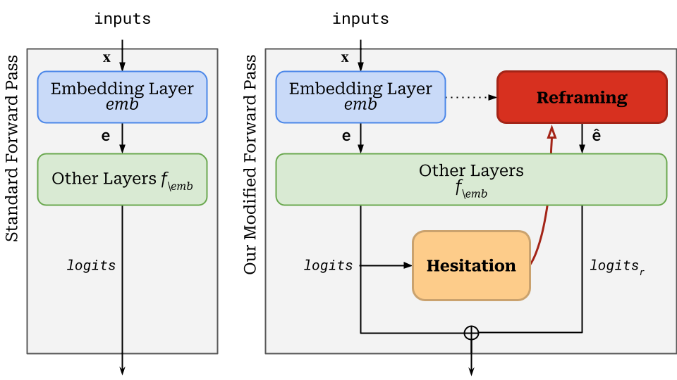

<div align="center">
    <h1>HARP<span style="font-size: 0.6em">: Hesitation-Aware Reframed Forward Pass</span></h1>
    <p>
        <a href="https://arxiv.org/abs/2412.07282">
            
        </a>
        <a href="https://ldilab.github.io/project/harp/">
            
        </a>
        
    </p>
    <p>🏆 Improve the accuracy of your Transformer-based LLMs 🏆</p>
</div>


<div align="center">
Official implementation of <strong>HARP: Hesitation-Aware Reframing in Transformer Inference Pass</strong> (Romain Storaï and Seung-won Hwang, 2024).
</div>

<br>

### 📰 News
- **December 2024**: We release HARP to the world! 🌎


<br>

## 🚀 What is HARP?

HARP is a simple yet powerful method to improve the accuracy of Transformer-based models without retraining or fine-tuning. Inspired by human behaviors, HARP applies extra computation selectively at moments of hesitation.

### How does it work?

HARP is a modification to the Transformer forward pass. It encompasses two main elements:
1. **Hesitation Detection**: by using the logits of the next token, our method determines if the model is hesitating.
2. **Reframing**: if the model is hesitating, the inputs are reframed (shown through another perspective) and an additional forward pass is performed. 

To implement hesitation, we use the Shannon Entropy of the last-position logits and a threshold $\theta$. If the entropy is above $\theta$, the model is considered to be hesitating.
Reframing is done by applying dropout (with a chance $\delta$) on the input embeddings. After the second forward pass, the outputs are combined with the original outputs as a $\beta$-weighted sum.

## 🛠️ How to use?

HARP works seamlessly with any HuggingFace models. Import the files of this project and follow the steps below:

### 1. Wrap your model

Once you loaded your model, you can wrap it with HARP:

```python
from transformers import AutoTokenizer, AutoModelForCausalLM
from harp import HARPWrapper

# Load your HuggingFace model
model_name = "model_name_here"
tokenizer = AutoTokenizer.from_pretrained(model_name)
hf_model = AutoModelForCausalLM.from_pretrained(model_name)

# Wrap with HARP
model = HARPWrapper(hf_model, theta=1.0, delta=0.2, beta=0.5)
```

### 2. Generate text

You can now generate text with your model:

```python
from generation import autoregressive_generate, GreedyProcessor

logits_processor = GreedyProcessor()  # or any other processor (e.g. NucleusProcessor)
inputs = "I can't believe how HARP is simple yet amazing! And no, I'm not talking about the music instrument."
tokenized_input = tokenizer(inputs, return_tensors="pt").input_ids[0].tolist()

generated_tokens = autoregressive_generate(
    inputs=tokenized_input,
    model=model,
    max_gen_len=120,
    logits_processor=logits_processor,
    vanilla=False  # If True, the model is used without HARP
)

output_text = tokenizer.decode(generated_tokens)
print(output_text)
```

Note that we also implemented beam search decoding for the vanilla models with `beam_search_generate`.

### 🎹 Demo Script

To see HARP in action, we have provided a demo file that you can run. Simply execute the following command:

```bash
python demo.py
```

By default, it will load LLaMA 3.1 8B Instruct. You can change the different parameters and the model using the arguments of the script.
Once the model is loaded, type a prompt and the model will generate a completion both with and without HARP.

### Requirements

This project works with the latest version of HuggingFace transformers and PyTorch. We recommend using a virtual environment using Python 3.10 and the packages in `requirements.txt`.

```bash
python -m venv harp
source harp/bin/activate
pip install -r requirements.txt
```

## 📜 License

This project is under Apache 2.0 License. See the [LICENSE](LICENSE) file for more details.

## 🧰 Known Limitations

Our method does not support caching. Since the reframing changes the input embeddings, it invalidates the KVCache and require (at each reframing step), to recompute the attention weights---temporally increasing the VRAM usage.

We are currently working on a solution to this issue. Our current best track is to apply the reframing on the KVCache itself, or at least on some definite layers of the model.

## 📝 Cite

If you find HARP useful or relevant to your research, please cite our paper!

```bibtex
@misc{storaï2024harphesitationawarereframingtransformer,
      title={HARP: Hesitation-Aware Reframing in Transformer Inference Pass}, 
      author={Romain Storaï and Seung-won Hwang},
      year={2024},
      eprint={2412.07282},
      archivePrefix={arXiv},
      primaryClass={cs.CL},
      url={https://arxiv.org/abs/2412.07282}, 
}
```